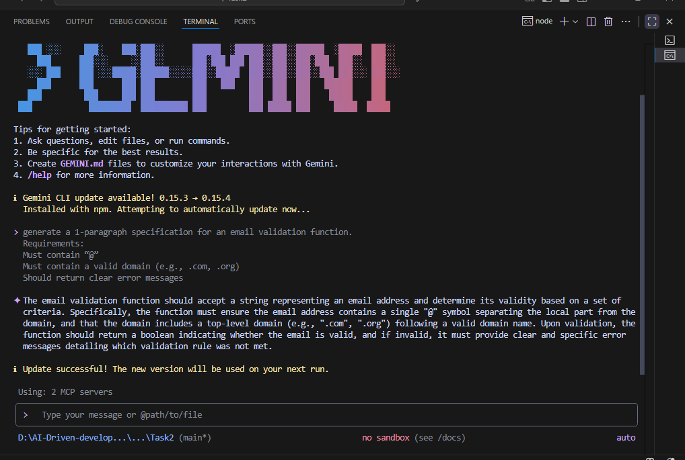

## AI-Driven Development — 30-Day Challenge
## 📝 Task 2

## 📁 Part A — Theory (Short Questions)

# 1️⃣ Nine Pillars Understanding

**Q1: Why is using AI Development Agents (like Gemini CLI) for repetitive setup tasks better for your growth as a system architect?**

**Answer:**

- Agar hum manually repetitive tasks karte rahen to time waste hota hai aur dimag sirf small details me phas jata hai. AI Development Agents ye repetitive kaam automate kar dete hain. Isse hum apna focus bade design aur architecture pe rakh sakte hain. Matlab hum sirf code likhne ke bajaye system-level sochna start kar dete hain. Ye help karta hai faster aur smart growth me, aur AI ke sath kaam karke hamesha updated rehna easy ho jata hai.

**Q2: Explain how the Nine Pillars of AIDD help a developer grow into an M-Shaped Developer.**

**Answer:**
- Nine pillars basically ek complete system hai. Ye pillars AI agents, TDD, SDD, deployment aur skills modules ko combine karte hain. In pillars ki help se ek developer 2-4 related domains me deep expertise develop kar sakta hai—jaise frontend + backend + DevOps ya ML + backend + data. Har pillar ek problem solve karta hai: AI agents knowledge gap fill karte hain, SDD clear roadmap deti hai, aur universal deployment operations handle kar deta hai. Result: ek M-Shaped Developer, jo multiple areas me confidently kaam kar sakta hai.

# 2️⃣ Vibe Coding vs Specification-Driven Development

**Q1: Why does Vibe Coding usually create problems after one week?**

**Answer:**
- Vibe Coding basically “feel ke basis pe coding” hai—kuch bhi plan nahi, bas intuition pe code likhna. Shuru me sab thik lagta hai, lekin ek week me code messy aur confusing ho jata hai. Bugs aate hain, architecture complicated ho jata hai, aur maintain karna mushkil ho jata hai.

**Q2: How would Specification-Driven Development prevent those problems?**

**Answer:**
- SDD me pehle clear specifications likh di jati hain—matlab exact kya karna hai aur kaise karna hai. Isse code structured aur predictable ho jata hai. Future me bugs kam aate hain aur AI agents bhi specification follow karke sahi code generate karte hain. Isse long-term me kaam easy aur clean rehata hai.

# 3️⃣ Architecture Thinking

**Q1: How does architecture-first thinking change the role of a developer in AIDD?**

**Answer:**
- Architecture-first thinking me hum sirf line-by-line code pe focus nahi karte, balki system aur layers pe sochte hain. Har cheez ek modular stack ka part hai (models → IDEs → agents). Developer ab sirf code writer nahi, system designer aur AI collaborator ban jata hai.

**Q2: Explain why developers must think in layers and systems instead of raw code.**

**Answer:**
- Layers aur system thinking se code maintainable aur scalable hota hai. Ek layer me change karne se baaki system easily handle kar leta hai. Ye approach AI aur Nine Pillars ke sath combined hoke M-Shaped expertise build karne me help karta hai—yaani multiple domains me deep aur usable skills.

## 📁 Part B — Practical Task

**Task: Using AI CLI, generate a 1-paragraph specification for an email validation function.**

**My CLI Prompt:**

Generate a 1-paragraph specification for an email validation function that:
1. Must contain "@"
2. Must have a valid domain (like .com, .org)
3. Should give clear error messages if invalid

**CLI Output (Specification Generated):**

The email validation function should accept a string representing an email address and determine its validity based on a set of criteria. Specifically, the function must ensure the email address contains a single "@" symbol separating the local part from the domain, and that the domain includes a top-level domain (e.g., ".com", ".org") following a valid domain name. Upon validation, the function should return a boolean indicating whether the email is valid, and if invalid, it must provide clear and specific error messages detailing which validation rule was not met.

# Screenshot attached showing CLI prompt + output. ✅

## 📁 Part C — Multiple Choice Questions

- 1. What is the main purpose of Spec-Driven Development?
**Answer:** B. Clear requirements before coding begins

- 2. What is the biggest mindset shift in AI-Driven Development?
**Answer:** B. Thinking in systems and clear instructions

- 3. Biggest failure of Vibe Coding?
**Answer:** B. Architecture becomes hard to extend

- 4. Main advantage of using AI CLI agents (like Gemini CLI)?
**Answer:** B. Handle repetitive tasks so dev focuses on design & problem-solving

- 5. What defines an M-Shaped Developer?
**Answer:** C. Deep skills in multiple related domains